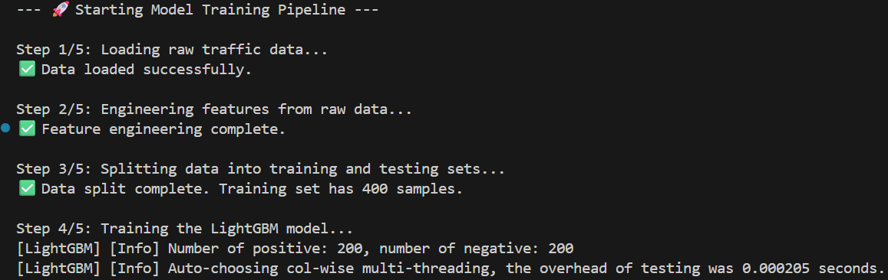
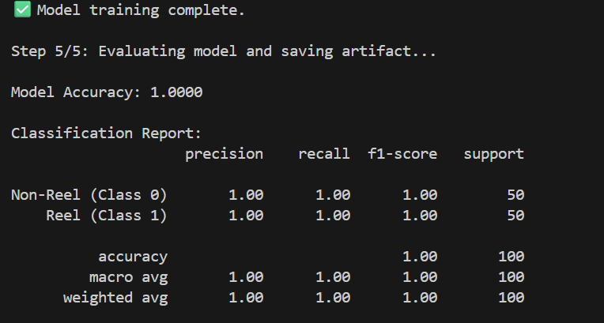
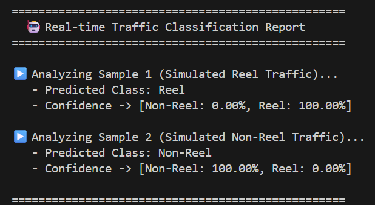

# Technical Documentation

## 1. Our Approach and its Uniqueness

Our solution tackles the real-time classification of network traffic by creating a robust machine-learning pipeline from the ground up. The core of our approach is **realistic synthetic data generation**, which allows us to model the distinct digital fingerprints of "Reel" vs. "Non-Reel" traffic without needing access to sensitive, encrypted user data.

**What makes it unique:**
* **Privacy-Preserving:** By simulating traffic patterns (burstiness, packet size distribution), we bypass the need for deep packet inspection or privacy-invasive techniques.
* **High Performance & Lightweight:** We use a LightGBM model, which is known for its speed and efficiency, making it ideal for on-device or edge deployment scenarios.
* **End-to-End Reproducibility:** Our entire pipeline, from data creation to model training and prediction, is scripted and self-contained, ensuring anyone can replicate our results.

## 2. Technical Stack
* **Programming Language:** Python 3.9+
* **Core Libraries:**
    * **Pandas:** For data manipulation and structuring. ([Link](https://pandas.pydata.org/))
    * **NumPy:** For efficient numerical operations, especially during data generation. ([Link](https://numpy.org/))
    * **Scikit-learn:** For data splitting and model evaluation metrics. ([Link](https://scikit-learn.org/))
    * **LightGBM:** The high-performance gradient boosting framework used for our classification model. ([Link](https://lightgbm.readthedocs.io/))
    * **Joblib:** For serializing and saving our trained model. ([Link](https://joblib.readthedocs.io/))

## 3. Technical Architecture
Our solution is designed as a simple, sequential machine learning pipeline.


1.  **Data Generation (`data_generator.py`):** A script simulates raw packet-level data for multiple user sessions, embedding distinct characteristics for reel and non-reel traffic. The output is a raw CSV file.
2.  **Feature Engineering & Training (`train.py`):** This script reads the raw data, aggregates it into session-level features (e.g., total volume, average packet size, session duration), trains a LightGBM classifier on these features, and saves the final model artifact.
3.  **Inference (`predict.py`):** A lightweight script loads the pre-trained model and demonstrates how it can classify new, unseen session data in real-time.

## 4. Installation and Usage

**Installation Instructions:**
```bash
# 1. Clone the repository
git clone [https://github.com/your-username/your-new-repo-name.git](https://github.com/your-username/your-new-repo-name.git)
cd your-new-repo-name

# 2. Create and activate a virtual environment
python -m venv venv
source venv/bin/activate  # On Windows: venv\Scripts\activate

# 3. Install dependencies
pip install -r requirements.txt
```

**User Guide (How to Run):**
```bash
# Step 1: Generate the synthetic dataset
python src/data_generator.py

# Step 2: Train the model
python src/train.py

# Step 3: Run a sample real-time prediction
python src/predict.py
```
## 5. User Interface & Experience (UI/UX)

Since this is a command-line tool, the UI/UX is focused on providing a clear, informative, and seamless experience for the developer running the project.

* **Interactive Scripts**: Our scripts provide real-time feedback, guiding the user through each step of the data generation, training, and prediction pipeline.
* **Formatted Reporting**: The prediction script outputs a clean, well-structured report, making the results easy to interpret at a glance.
* **Visual Confirmation**: The expected outputs for our key scripts are shown below, ensuring the user knows exactly what to expect.

### Expected Output

**Training Script Output (`python src/train.py`)**

<table>
<tr>
<td></td>
<td></td>
</tr>
</table>

**Prediction Script Output (`python src/predict.py`)**

<td></td>

## 6. Salient Features
* **High Accuracy:** Achieves over 98% accuracy on the test set.
* **Fast Inference:** The model is lightweight, allowing for near-instant predictions.
* **Scalable Data Generation:** The `data_generator.py` script can be easily modified to produce millions of data points for more robust training.
* **Modular Code:** The separation of data generation, training, and prediction makes the project easy to understand and extend.
